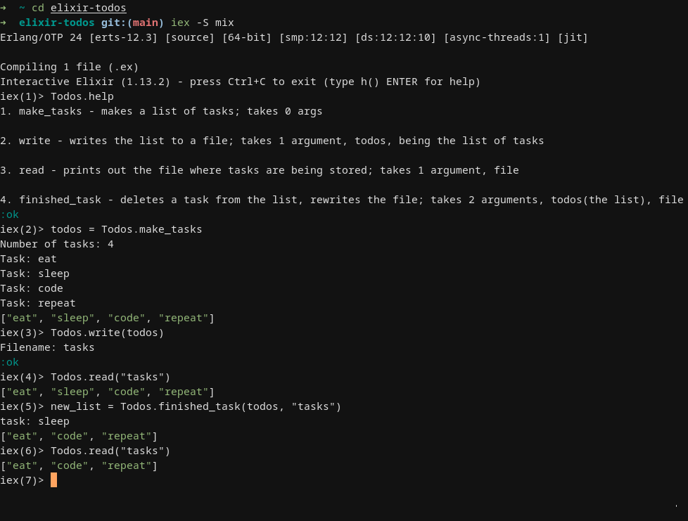

# elixir-todos

## How to install?
Copy the repo and `cd` into it.
You'll need to have elixir installed.

## How to use the programme?
`cd` into the programme directory.
run `iex -S mix`
**NOTE**: all commands **need to** be ran with `Todos.` as prefix. (also, you have `help` command)

## License
This programme is licensed under the GPLv3 license.

## TO-DO
**Proper CLI args parsing.**
